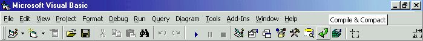



## VB6 Compile & Compact Add\-In

### Description

This application is a Visual Basic 6 IDE Add-In which allows users to compile, compress and scramble their applications at a press of a button on the VB IDE. This simplifies the compilation/compaction/scrambling process into one Button. Compaction significantly reduces the size of the compiled application and gives it a layer of protection (minimal).

----

Once you compile the add-in you need to register it for VB6 IDE to load it. Just go to the directory in which your add-in dll is in and run 'regsvr32 compilact.dll' in MSDOS console. After this the add-in should automatically load on VB startup. If you wish to use it with VB5 you will to load the add-in through the Add-In manager or by adding it to the vbaddin.ini file.

----

The add-in assumes that you have UPX.EXE (http://upx.sourceforge.net) in your WINDOWS or WINNT directory.

----

If you wish to see the add-in without having to compile the code you can download it from here: 

----

http://tical.vze.com/files/compilact.zip

----

'UPX' is Copyright (C) 1996-2002

----

Markus Franz Xaver Johannes Oberhumer

----

Laszlo Molnar

----

 
### More Info
 

             |
---                |---
**Submitted On**   |2003-05-11 23:11:16
**By**             |[TiCaL](https://github.com/Planet-Source-Code/PSCIndex/blob/master/ByAuthor/tical.md)
**Level**          |Advanced
**User Rating**    |4.7 (80 globes from 17 users)
**Compatibility**  |VB 5\.0, VB 6\.0
**Category**       |[OLE/ COM/ DCOM/ Active\-X](https://github.com/Planet-Source-Code/PSCIndex/blob/master/ByCategory/ole-com-dcom-active-x__1-29.md)
**World**          |[Visual Basic](https://github.com/Planet-Source-Code/PSCIndex/blob/master/ByWorld/visual-basic.md)
**Archive File**   |[VB6\_Compil1587135132003\.zip](https://github.com/Planet-Source-Code/tical-vb6-compile-compact-add-in__1-45405/archive/master.zip)

